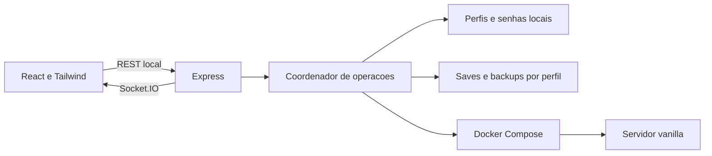

# Socius — gerenciador pessoal de Valheim

> **🚧 WIP — Projeto em desenvolvimento**
>
> O Socius ainda está em desenvolvimento e será atualizado com o tempo. Funcionalidades, interface e documentação podem mudar conforme o projeto evolui.

Painel para PC que administra um servidor vanilla, guarda configuracoes por mundo e protege saves com backups verificados. O servidor continua funcionando com o cliente do jogo fechado.

## Instalar e abrir

Requisitos: virtualizacao habilitada, WSL 2, Docker Desktop aberto com containers Linux e Node.js 22 LTS recomendado (runtime atual: Node 20.18).

```powershell
npm ci
npm run setup
npm run doctor
npm run build
npm start
```

Abra **http://127.0.0.1:3000**. Desenvolvimento: `npm run dev` e http://127.0.0.1:5173. No Windows, `scripts/start-panel.ps1` facilita iniciar uma nova sessao.

O setup configura apenas a instalacao. Mundos, senhas e portas sao configurados pela tela **Mundos**, sem editar arquivos. Mantenha o PC ligado e sem suspensao. Backups diarios exigem o painel aberto.

No Windows, os dados ficam por padrao em `%USERPROFILE%\Socius`, uma pasta propria do aplicativo. Ajuste `DATA_DIR` no .env para usar outro disco ou diretorio. Instalacoes existentes preservam o caminho ja configurado. Mantenha os dados fora de pastas com sincronizacao de nuvem ativa.

## Usar mundos

1. Abra **Mundos**. O catalogo lista os saves em `%USERPROFILE%\AppData\LocalLow\IronGate\Valheim\worlds_local` e seus perfis salvos. Outra origem pode ser definida com `IMPORT_ROOT`.
2. Selecione um mundo local, preencha nome do servidor, senha, porta principal, crossplay e visibilidade. Feche esse mundo no Valheim antes de confirmar a importacao. Saves na Steam Cloud precisam ser movidos para Local pelo jogo.
3. Para um mundo novo, clique em **Criar novo mundo** e defina o nome e as configuracoes. O perfil e salvo imediatamente; o Valheim gera um mapa aleatorio no primeiro inicio. Nao ha selecao de seed.
4. Clique em **Ativar mundo**. Se o servidor estiver ligado, a confirmacao avisa sobre desconexao dos jogadores; o Socius encerra, faz backup do mundo anterior e inicia o escolhido. Se estiver parado, continua parado.
5. Inicie o servidor e aguarde **Pronto para jogar**. O primeiro download pode demorar. Iniciando e pronto sao estados diferentes.
6. Use o codigo de entrada da Visao geral e a senha consultada em Mundos. A senha pode ser mostrada, copiada ou substituida. Deixe o campo de substituicao vazio para manter a senha existente.

Selecionar um perfil na tela apenas exibe suas informacoes. Suas configuracoes sao lembradas apos reiniciar o painel; ao voltar a um mundo, o Socius usa o save administrado, com o progresso do servidor, sem reimportar a origem.

Um perfil possui nome do servidor, senha de 5 a 64 caracteres ASCII sem espacos, porta UDP principal de 1024 a 65534, crossplay e listagem publica. A segunda porta e principal + 1. O nome do servidor nao pode conter a senha.

Mundos incompletos aparecem indisponiveis com o motivo. Saves legados .db/.fwl e diretorios modernos com marcador de save confirmado sao aceitos; arquivos de backup automatico nao aparecem como mundos.

Crossplay vem habilitado: use o codigo de entrada, inclusive neste PC. Para backend Steam, desative crossplay no formulario e use IP:porta; conexoes externas exigem encaminhar as duas portas UDP no roteador/firewall. CGNAT pode impedir conexao direta. O dominio do portfolio nao participa da hospedagem.

## Persistencia e migracao

```text
SociusData/
  profiles.json                  # catalogo versionado e perfil ativo
  secrets/passwords.json         # senhas locais; fora dos backups e do Git
  profiles/<id>/config/          # dados montados no container deste perfil
  profiles/<id>/config/worlds_local/
  profiles/<id>/backups/         # copias e manifestos SHA-256
  server/                       # instalacao do jogo compartilhada
  history/                      # operacoes e lock do painel
```

Apenas um servidor fica ativo por vez. Perfis isolam saves e backups, compartilhando a instalacao do jogo. Senhas sao armazenadas em um arquivo local separado; nao ha criptografia adicional do aplicativo. Proteja o acesso ao computador e a pasta de dados.

Na primeira abertura apos atualizar, o Socius migra o mundo da versao anterior: para graciosamente se estava ligado, cria copia de recuperacao, verifica as copias, salva o perfil e retoma o servidor. As estruturas antigas `config` e `backups` ficam preservadas para recuperacao. A migracao concluida nao se repete. Uma falha deixa o servidor parado e conserva os dados anteriores.

O .env passa a conter somente imagem Docker, porta do painel, horario do backup e caminhos. A migracao remove as antigas variaveis de mundo e senha somente depois de persistir os perfis.

## Backups e recuperacao

- Manuais e diarios a partir das 04h de Brasilia, para o mundo ativo, enquanto o painel estiver aberto.
- O servidor encerra graciosamente antes da copia e retoma se estava ligado. Encerramento forcado impede a copia.
- Cada mundo conserva sete backups regulares. Recuperacoes r-* e diretorios .previous-* sao preservados; acompanhe o espaco usado.
- Restauracao exige confirmacao, verificacao SHA-256 e backup previo de recuperacao. Backups de outro perfil sao recusados.
- Em falha depois da parada, o servidor fica desligado. Consulte Atividade antes de tentar iniciar; arquivos incompletos .pending-* nao sao oferecidos para restaurar.
- Copie backups concluidos para outro dispositivo quando necessario; uma copia no mesmo disco nao protege contra falha do disco.

Recuperacao manual: pare o servidor e feche o painel. Identifique o perfil em profiles.json, preserve seus saves atuais e copie a pasta worlds do backup desse perfil para profiles/<id>/config/worlds_local. Nao altere o backup original nem renomeie o mundo. Se a migracao falhar antes de profiles.json existir, os dados antigos permanecem em config e backups; corrija a causa e abra novamente. Se senhas ou catalogo estiverem danificados, preserve tudo e recupere os respectivos arquivos a partir de uma copia administrativa da pasta de dados.

Evite pastas com sincronizacao ativa, links simbolicos ou restricoes que impeçam renomeacoes atomicas. O Socius nao altera protecoes de pastas existentes.

## Arquitetura e padrao de codigo

React + Vite + TypeScript, Tailwind CSS 4, TanStack Query e Socket.IO. Telas, componentes, apresentacao e hooks sao separados. A API Express separa configuracao da instalacao, perfis, saves/backups, Docker e coordenacao de operacoes.



Uma trava serializa operacoes; outra impede paineis simultaneos na mesma pasta. API em 127.0.0.1, validacao Host/Origin e token local. Docker recebe argumentos fixos e o container precisa ter os labels do Socius. Todas as senhas conhecidas sao removidas dos logs e mensagens de operacao.

Credenciais anteriores ficam preservadas no arquivo separado para permitir troca atomica da referencia no catalogo e mascarar logs de sessoes antigas. Elas nao entram nos backups de saves.

Prettier e ESLint definem o padrao descrito em [CONTRIBUTING](CONTRIBUTING.md). Estilos usam utilitarios e tokens Tailwind, com variantes completas. Nao ha suporte mobile.

## Interfaces

| Interface                      | Resultado                                              |
| ------------------------------ | ------------------------------------------------------ |
| GET /api/session               | Token local                                            |
| GET /api/snapshot              | Estado, metricas, logs, historico e backups ativos     |
| GET /api/worlds                | Catalogo local, perfis e activeProfileId               |
| POST /api/profiles             | Criacao/importacao; retorna operacao HTTP 202          |
| PUT /api/profiles/:id          | Atualizacao de configuracoes; retorna operacao         |
| GET /api/profiles/:id/password | Consulta explicita da senha com token                  |
| POST /api/operations           | Iniciar, parar, reiniciar, backup, restaurar ou ativar |
| Socket.IO snapshot / operation | Estado e progresso                                     |

Todas as rotas exceto session exigem x-manager-token. Perfis e eventos gerais nao incluem senhas. Criacao recebe serverName, port, crossplay, public, password e worldName ou worldId. Atualizacao recebe settings e confirm; senha omitida preserva a existente. Ativacao recebe action=activate, profileId e confirm=true. Operacoes concorrentes recebem HTTP 409.

## Verificar e atualizar

```powershell
npm run format:check
npm run lint
npm test
npm run build
node scripts/verify-ui.mjs
```

GitHub Actions verifica formatacao, lint, testes, tipos e build. A verificacao do navegador usa Edge no Windows, cobre desktop de 1280 e 1440 pixels e salva capturas sem codigo de entrada ou senhas. Outra instalacao pode informar BROWSER_PATH.

Veja [validacao local](docs/VALIDATION.md) e [captura do painel](docs/screenshots/overview-desktop.png).

Para atualizar o jogo: avise os jogadores, faca backup e pare o servidor. Verifique o novo digest da imagem quando necessario, ajuste VALHEIM_IMAGE e reinicie o painel antes de iniciar o mundo. A imagem e fixada por digest, mas o binario baixado pelo SteamCMD pode ser atualizado no inicio. Rollback exige save e binario compativeis.

A integridade dos arquivos e o estado pronto nao comprovam o progresso dentro do jogo. Conferir construcoes, jogar com quatro pessoas e restaurar progresso identificavel continua sendo validacao humana. Cada 100% de CPU representa um nucleo; meça memoria com o cliente e os quatro jogadores antes de ajustar limites.

## Referencias

- [Servidor dedicado oficial](https://valheim.com/support/a-guide-to-dedicated-servers/)
- [Imagem comunitaria](https://github.com/community-valheim-tools/valheim-server-docker)
- [Tailwind com Vite](https://tailwindcss.com/docs/installation/using-vite)
- [Docker Desktop](https://docs.docker.com/desktop/setup/install/windows-install/)
- [WSL](https://learn.microsoft.com/en-us/windows/wsl/install)

Saves, senhas, backups, dependencias e builds nao entram no Git. O repositorio nao redistribui arquivos do jogo.
